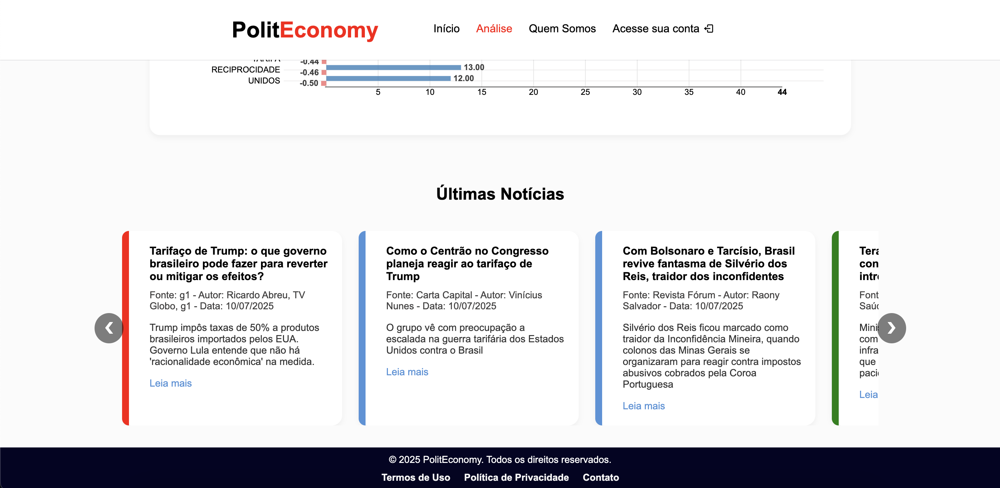

Análise de Sentimento de Notícias Políticas e Econômicas

## Visão Geral do Projeto

O PolitEconomy é uma plataforma web desenvolvida para auxiliar investidores, analistas e qualquer pessoa interessada a navegar com segurança no complexo cenário político e econômico brasileiro. Nosso sistema coleta e analisa notícias de diversas fontes renomadas, aplicando **Inteligência Artificial (IA)** para realizar uma **análise de sentimento imparcial**. O objetivo é transformar um volume massivo de informações em **insights acionáveis**, permitindo aos usuários **antecipar tendências e tomar decisões mais embasadas**.

A plataforma oferece dashboards visuais, recursos de busca avançada e um sistema de notificações personalizadas, garantindo que você esteja sempre à frente dos acontecimentos que podem impactar o mercado.

## Funcionalidades Principais

* **Coleta Automatizada de Notícias:** Realiza web scraping de portais como Agência Brasil, BBC, Carta Capital, Câmara dos Deputados, Congresso em Foco, G1, InfoMoney, Revista Fórum e O Tempo.
* **Análise de Sentimento por IA:** Utiliza modelos de Inteligência Artificial (baseados em BERT) para classificar o sentimento de cada notícia (positivo, negativo, neutro).
* **Dashboards Interativos na Página de Análise:**
    * **Seleção de Análise (Economia/Política):** Permite ao usuário filtrar as análises para ver dados sobre Economia, Política, ou ambos, influenciando os tópicos e análises exibidos.
    * **Tópicos em Alta:** Exibe os 3 tópicos mais relevantes relacionados à sua seleção de análise (Economia/Política).
    * **Distribuição de Notícias por Portal:** Um gráfico de pizza mostra a porcentagem de notícias provenientes de cada portal.
    * **Sentimento Diário do Mercado:** Um gráfico de barras que permite analisar o sentimento (positivo, negativo, neutro) das notícias diariamente.
    * **Top 20 Tópicos Mais Mencionados:** Um gráfico detalhado exibindo os 20 tópicos mais mencionados, com suas respectivas quantidades de notícias e sentimento médio.
* **Busca Avançada na Página de Busca:**
    * Pesquise notícias por **tópico, manchete ou autor**.
    * Defina um **intervalo de tempo** (data de início e data limite) para filtrar as notícias.
    * Selecione um **portal específico** de onde deseja ver as notícias relacionadas à sua pesquisa.
* **Notificações Personalizadas:** Usuários registrados podem definir palavras-chave de interesse para receber alertas por e-mail sobre novas notícias relevantes.
* **Autenticação de Usuários:** Sistema completo de registro, login e logout seguro.

## Arquitetura do Sistema

O PolitEconomy segue uma arquitetura distribuída, composta pelos seguintes módulos principais:

* **Frontend:** A interface de usuário, construída com HTML, CSS e JavaScript puro, responsável pela interação visual e requisições à API.
* **Backend (API):** Desenvolvido em Node.js com Express, gerencia as rotas da API, a autenticação de usuários (JWT), a lógica de negócio e as operações com o banco de dados.
* **Coletor de Dados (Web Scrapers):** Scripts Node.js utilizando Puppeteer para automatizar a extração de notícias dos portais.
* **Módulo de Inteligência Artificial (IA):** Scripts Python para análise de sentimento (treinamento, teste e aplicação de modelos como BERT) e clustering de notícias.
* **Banco de Dados:** MongoDB, utilizado para armazenar todas as notícias coletadas e analisadas, bem como os dados dos usuários e suas preferências.

## Tecnologias Utilizadas

### Frontend
* **HTML5, CSS3, JavaScript** (puro)
* **Chart.js** para gráficos de linha e rosca.
* **NVD3.js / D3.js** para gráficos de barra.
* **Boxicons** para ícones.

### Backend
* **Node.js** com **Express.js**.
* **MongoDB** como banco de dados.
* **Mongoose** como ODM para MongoDB.
* **Bcrypt** para hashing de senhas.
* **JSON Web Token (JWT)** para autenticação.
* **Nodemailer** para envio de e-mails.
* **Node-cron** para agendamento de tarefas.
* **CORS** para controle de acesso.
* **Dotenv** para variáveis de ambiente.

### Coletor de Dados
* **Node.js**
* **Puppeteer** para web scraping.

### Módulo de Inteligência Artificial
* **Python**
* **Hugging Face Transformers** (inferido pelo uso de BERT).
* **Scikit-learn** (inferido pelo uso de clustering).
* **Pandas** e **NumPy** (comumente usados em projetos de IA com Python)
* **PyMongo** (para interação com MongoDB nos scripts Python).

## Screenshots

### Aqui estão algumas telas da aplicação:

* #### Interface de Análise





* #### Interface de Pesquisa com Termo Especificado


Este é um exemplo da nossa dashboard de análise.

## Como Fazer o Projeto Funcionar Localmente

Para configurar e rodar o PolitEconomy em sua máquina local, siga os passos abaixo.

### Pré-requisitos

Certifique-se de ter o seguinte software instalado:

* **Node.js** (versão LTS recomendada)
* **npm** (gerenciador de pacotes do Node.js, vem com o Node.js)
* **Python 3.8+**
* **pip** (gerenciador de pacotes do Python, vem com o Python)
* **MongoDB** (servidor rodando localmente ou acesso a um Atlas Cluster)
* **Git**

### 1. Clonar o Repositório

Primeiro, clone o repositório do projeto para sua máquina local:

```bash
git clone https://github.com/4venturelli/PolitEconomy
cd PolitEconomy
```
### 2. Configuração do Backend

Navegue até o diretório backend:
```bash
cd backend
```
### 2.1. Variáveis de Ambiente

Crie um arquivo .env na raiz do diretório backend com as seguintes variáveis:

```bash
MONGO_URI="mongodb://localhost:27017/Banco_Coletor"
SECRET="Sua_Chave_Secreta_JWT_Aqui"
EMAIL_USER="seu_email@exemplo.com" # Ou usuário do Mailtrap
EMAIL_PASS="sua_senha_email"       # Ou senha do Mailtrap
MONGO_URI: Se você estiver usando um MongoDB local, mongodb://localhost:27017/Banco_Coletor deve funcionar. Se for um MongoDB Atlas, use sua URI de conexão fornecida pelo Atlas.
```

SECRET: Uma string longa e complexa para assinar os tokens JWT. Gere uma string aleatória.

EMAIL_USER e EMAIL_PASS: Credenciais para o serviço de e-mail usado para notificações. Durante o desenvolvimento, o projeto está configurado para usar o Mailtrap. Você pode criar uma conta gratuita no Mailtrap para obter seu host, port, username e password para testes. Ajuste o transporter em backend/index.js para usar o host e port corretos se o Mailtrap mudar, ou mude para um serviço real (ex: Gmail, Outlook) em produção.

### 2.2. Instalar Dependências

Instale as dependências Node.js do backend:
```bash 
npm install
```

### 3. Configuração do Módulo de IA

Vá até o diretório backend/analise_sentimento:
```bash
cd backend/analise_sentimento
```

### 3.1. Criar Ambiente Virtual (Recomendado)

Criar um ambiente virtual Python para gerenciar as dependências:
```bash 
python -m venv venv
```

#### No Windows

```bash
.\venv\Scripts\activate
```

#### No macOS/Linux

```bash
source venv/bin/activate
```

### 3.2. Instalar Dependências Python

Instale as bibliotecas Python necessárias. Crie um arquivo requirements.txt na pasta backend/analise_sentimento com o seguinte conteúdo.

```bash
transformers
torch # ou tensorflow, dependendo de como o modelo BERT é usado
scikit-learn
pandas
pymongo
```

Depois, instale:

```bash
pip install -r requirements.txt
```

### 3.3. Conjunto de Dados

Confira se o arquivo brazilian_headlines_sentiments.csv esteja no diretório backend/analise_sentimento/. Este é o dataset usado para treinamento do modelo de sentimento.

### 4. Configuração do Frontend

Vá para raiz do projeto.

```bash
cd ../../frontend
```

O frontend não possui dependências de pacotes npm para serem instaladas, pois utiliza HTML, CSS e JavaScript puro. Tenha certeza de que a estrutura de pastas está correta e que os arquivos estão acessíveis.

### 5. Rodar o Projeto

Você precisará iniciar o servidor do MongoDB (se estiver rodando localmente) e então o backend, coletor e frontend do projeto PolitEconomy.

### 5.1. Iniciar o Servidor MongoDB

Se você estiver rodando o MongoDB localmente, inicie ele. A forma de fazer isso varia de acordo com seu sistema operacional e instalação.

### 5.2. Iniciar o Backend

Na raiz do diretório principal do projeto (onde está o package.json), você pode iniciar o backend e o frontend simultaneamente usando o script start:

```bash
npm start
```

Este comando executará:

* npm run backend: Inicia o servidor Node.js (com nodemon para reinício automático em caso de mudanças no código).

* npm run frontend: Inicia um servidor web (com live-server) para o frontend.

Você verá mensagens dos servidores no seu terminal. O backend estará rodando em http://localhost:3000 e o frontend geralmente em http://localhost:8080.

### 5.3. Iniciar o Coletor de Notícias 

Se você precisa popular seu banco de dados com notícias, pode rodar o coletor separadamente. Em um novo terminal, na raiz do diretório principal do projeto:

```bash
npm run coletor
```

### 5.4. Treinar e Rodar o Módulo de IA 

Caso queira fazer a análise de sentimento, voce terá que:

* Treinar o Modelo (se ainda não tiver treinado):
  
```bash
python treinar_bert.py
```

* Analisar Notícias no Banco de Dados (aplicar sentimento):

```bash
python analise_banco.py
```

Este script vai ler as notícias sem sentimento do banco, aplicar o modelo e atualizar os registros.

### 5.5. Acessar a Aplicação

Com o backend e o frontend rodando, abra seu navegador web e acesse a URL do frontend, que geralmente é:

```bash
http://localhost:8080
```
